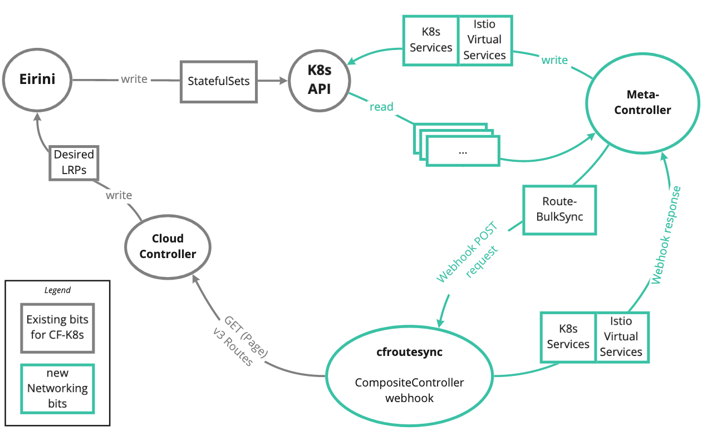

cf-k8s-networking
---
​
Routing and networking for Cloud Foundry running on Kubernetes.

​

​

## Contributing
Check out our [Contributing guidelines](CONTRIBUTING.md).

## Installation

### Prerequisites
- A Cloud Foundry deployment using [Eirini](https://github.com/cloudfoundry-incubator/eirini) for app workloads
- `kubectl` installed and access to the Kubernetes cluster backing Eirini
- [`kapp`](https://get-kapp.io/) installed
- [`ytt`](https://get-ytt.io/) installed

### Istio
* Install [Istio](https://istio.io/docs/setup/install/kubernetes/) to the Kubernetes cluster.
* Include the [istio-values.yaml](config/istio/istio-values.yaml) in your Istio installation.

    **Note:** As an example, in our CI we are installing Istio via the [deploy-istio.sh](ci/tasks/istio/deploy-istio.sh) task.

* Enable [​automatic sidecar injection](https://istio.io/docs/ops/configuration/mesh/injection-concepts/) by labeling
the following namespaces with `istio-injection=enabled`: `cf-system`, `cf-workloads`:

* Sidecars are required for automatic mTLS between workloads so it is important that this is enabled.
Confirm that the namespaces are labeled correctly:

    ```bash
    $ kubectl get namespaces -l istio-injection=enabled

    NAME             STATUS   AGE
    cf-system        Active   50d
    cf-workloads     Active   50d
    ```
​
### CF-K8s-Networking
1.  `cfroutesync` needs to be able to authenticate with UAA and fetch routes from Cloud Controller. To do this you must override the following properties from `install/ytt/networking/values.yaml`.
    You can do this by creating a new file `/tmp/values.yaml` that contains the following information:
    
    ```yaml
    #@data/values
    ---
    cfroutesync:
      ccCA: 'pem_encoded_cloud_controller_ca'
      ccBaseURL: 'https://api.example.com'
      uaaCA: 'pem_encoded_uaa_ca'
      uaaBaseURL: 'https://uaa.example.com'
      clientName: 'uaaClientName'
      clientSecret: 'uaaClientSecret'
    ```
    
    The UAA client specified by `clientName` is used for fetching routing data from Cloud Controller. It must have permission to access all routes and domains in the deployment. We recommend using a client with at least the `cloud_controller.admin_read_only` authority.
    For example, see the [network-policy](https://github.com/cloudfoundry/cf-deployment/blob/5b0221eac8579aa3c3ecfb4b714d96adf55a34a0/cf-deployment.yml#L662-L665) client in cf-deployment.
    
    As an example, for our dev environments we are using the [generate_values.rb](install/scripts/generate_values.rb) script
    to populate these values from the `bbl-state.json` and secrets in CredHub.
    
1. Deploy the cf-k8s-networking CRDs and components using [`ytt`](https://get-ytt.io/) and [`kapp`](https://get-kapp.io/):
    
    ```bash
    system_namespace="cf-system"

    ytt -f config/cfroutesync/ -f /tmp/values.yaml \
        -f cfroutesync/crds/routebulksync.yaml | \
        kapp deploy -n "${system_namespace}" -a cfroutesync \
        -f - \
        -y
    ```

1. Update the Prometheus configuration so metrics from cf-k8s-networking can be queried.

   ```bash
   prometheus_file="$(mktemp -u).yml"
   kubectl get -n istio-system configmap prometheus -o yaml > ${prometheus_file}

   ytt \
    -f "config/values.yaml" \
    -f "${prometheus_file}" \
    -f "config/deps/prometheus-config.yaml" | \
    kubectl apply -f -
   ```
   
   Note: you might need to restart Prometheus pod(s) in the istio-system namespace after updating the ConfigMap 🧐🥺
   
   ```bash
   kubectl -n istio-system delete pod -l app=prometheus
   ```
