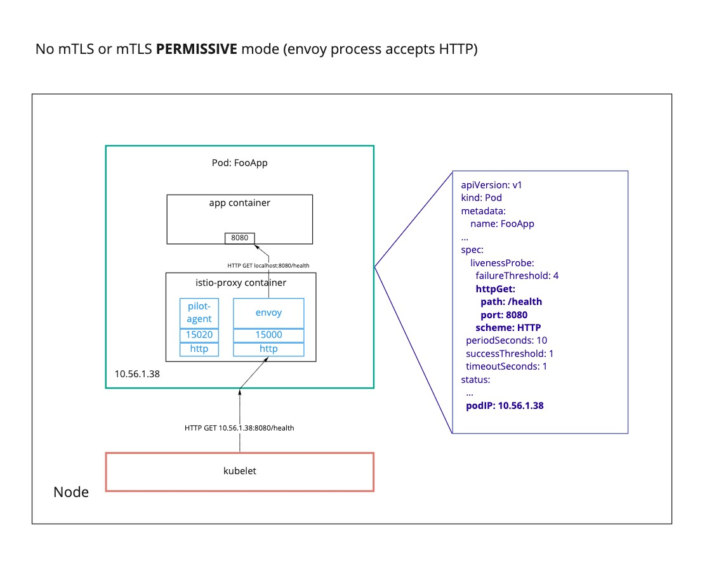
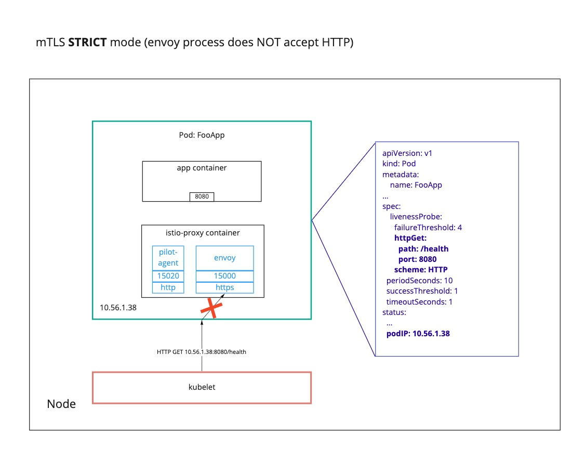
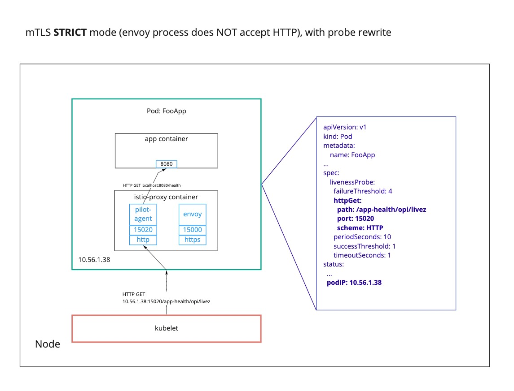

# 6. Rewrite HTTP Liveness and Readiness Probes for Healthchecks

Date: 2020-02-05

## Status

Proposal

## Context
With Istio auto mTLS enabled in `STRICT` mode, [http liveness and readiness
probes](https://kubernetes.io/docs/tasks/configure-pod-container/configure-liveness-readiness-startup-probes/) no longer work because the `kubelet`, which makes the http requests, does not have Istio issued certificates.

Istio [supports rewriting `http` probes](https://istio.io/docs/ops/configuration/mesh/app-health-check/#enable-globally-via-install-option) during the sidecar injection process.

#### Figure 1
_Liveness probe flow when Istio mTLS is disabled or `PERMISSIVE`. Probe `GET` request regularly travels through the Envoy sidecar to the app._

#### Figure 2
_Liveness probe flow when Istio mTLS is `STRICT` and the probe is not rewritten. Probe `GET` request fails at the Envoy sidecar because it does not include the correct certificates._

#### Figure 3
_Liveness probe flow when Istio mTLS is `STRICT` and the probe **is rewritten by Istio**. Probe `GET` request bypasses the sidecar and goes through the Istio `pilot-agent` instead. The `pilot-agent` is configured to direct the request to the app._

## Decision
We have decided to install Istio with

`--set values.sidecarInjectorWebhook.rewriteAppHTTPProbe=true`

This will rewrite the liveness and readiness probes on any app pods when injecting a sidecar into the app pod. Any namespaces that have the label `istio-injection=enabled` will have their liveness and readiness probes rewritten, as shown in Figure 3.

## Consequences
* We believe that rewriting the liveness and readiness probes will be compatible with the [health check configuration](https://docs.cloudfoundry.org/devguide/deploy-apps/healthchecks.html) that app devs can currently use in Cloud Foundry
* In the future, if CF app devs want more complex http healthchecks that involve more than checking the response code of the healthcheck endpoint, we may have to do some significant work.
